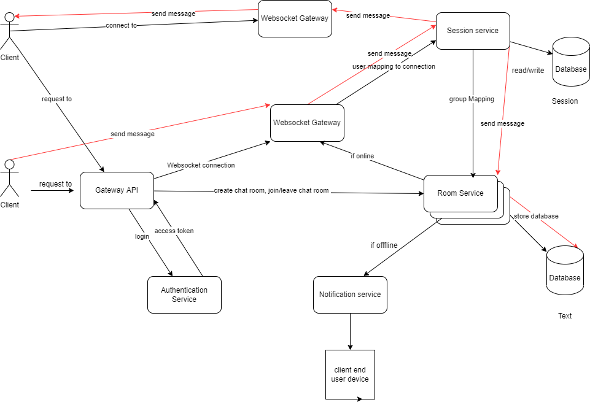

"# microservice-chat-app" 

I. Macro architecture
1. Websocket Gateway ( Component 1) 
Nhiệm vụ: Tạo kết nối websocket với client. Kết nối này sẽ được sử dụng để gửi tin nhắn hai chiều từ server trở lại client
Giới hạn: Component này chỉ có nhiệm vụ là kết nối với client, nếu nhận được request từ client, kết nối này sẽ chuyển request này sang các service khác phụ trách
Ghi chú: Ta sẽ tạo nhiều instance cho Websocket Gateway để có thể scale ứng dụng dễ dàng hơn (mỗi websocket chỉ có thể lưu trữ tối đa 65000 kết nối)

2. Session service 
Nhiệm vụ: Lưu trữ thông tin về kết nối của client với websocket gateway. Ví dụ client 1 kết nối với Websocket Gateway A, client 2 kết nối với Websocket Gateway B.
Session service sẽ ghi lại thông tin để viết client đã kết nối với gateway nào để có thể direct message của mình tới đúng gateway. 
Giới hạn: Session service không lưu thông tin về các message được gửi, cũng như các thông tin liên quan tới phòng chat. Session service sẽ chỉ lưu thông tin về 
kết nối của client. 
Ghi chú: Session service có database riêng để lưu trữ

3. Room service
Nhiệm vụ: Lưu trũ thông tin về các member của nhóm chat, thông tin của quản trị viên, quản lý việc create/leave/join phòng chat. Thông tin về các tin nhắn đã được gửi 
trong nhóm chat
Giới hạn: Service này chỉ lưu thông tin về các cuộc trò chuyện.
Ghi chú: Service này sẽ có một database riêng.

4. Authentication service
Nhiệm vụ: Xác nhận quyền hạn của người dùng. Quyền hạn của người dùng bao gồm: tạo chat, mời và xóa thành viên. Gửi file
Giới hạn: 
Ghi chú: Service này có thể sử dụng database riêng lẻ. Nếu sử dụng database riêng lẻ, ta bắt buộc phải cập nhật vào database của Room Service

5. Notification Service
Nhiệm vụ: Khi người dùng offline và kết nối trở lại, hoặc người dùng tắt app nhưng vẫn muốn nhận thông báo, service này sẽ gửi các tin nhắn chưa gửi đến cho người dùng.
Giới hạn:
Ghi chú: 

6. Gateway API
Nhiệm vụ: Routing các request tới các service, việc xuất hiện component này nhằm mục đích quản lý/lọc các request.
Giới hạn:
Ghi chú: 

II. Data flow
1. Đăng nhập
	Người dùng gửi request tới gateway API và được được routing tới authentication service. Authentication service tạo ra một access token và trả lại cho người dùng. Thông tin người dùng sẽ được lưu vào database 
	của authentication service => nó cũng sẽ tạo ra một post request tới database của roomservice để lưu trữ vào database của roomservice
2. Tạo nhóm
	Người dùng gửi request tới gateway API và được routing tới room service. Room service lưu thông tin vào database và push thông tin về nhóm qua notification service 
3. Gửi tin nhắn
	Người dùng gửi tin nhắn thông qua websocket tới websocket gateway. Websocket gateway sẽ gửi đưa message này tới session service. Ở đây session service tiếp tục gửi thông tin về topic tới room service 
	đẻ có thông tin về những người tham gia phòng chat. Sau khi nhận được thông tin về các user tham gia phòng chat từ room service, session service sẽ query để biết user này kết nối với websocket gateway nào 
	và gửi data tới websocket gateway đó. websocket gateway sẽ sử dụng thông tin nhận được từ session service để gửi tin nhắn tới người dùng
4. Nhận thông báo
	Khi websocket gateway không gửi được tin nhắn tới người dùng nó sẽ push tin nhắn này qua notification service
	
III. Requirement cho từng thành phần 
Phase 1:
	1. Gateway websocket
		Functional requirement: gửi thông tin giữa hai người, kiểm tra kết nối, có thể request tới session service. Tạo endpoint tới 
		Non-functional requirement: 

